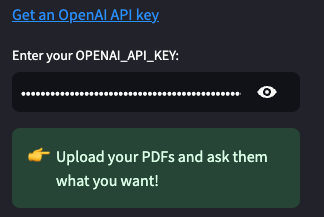
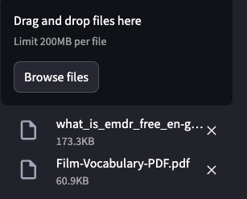
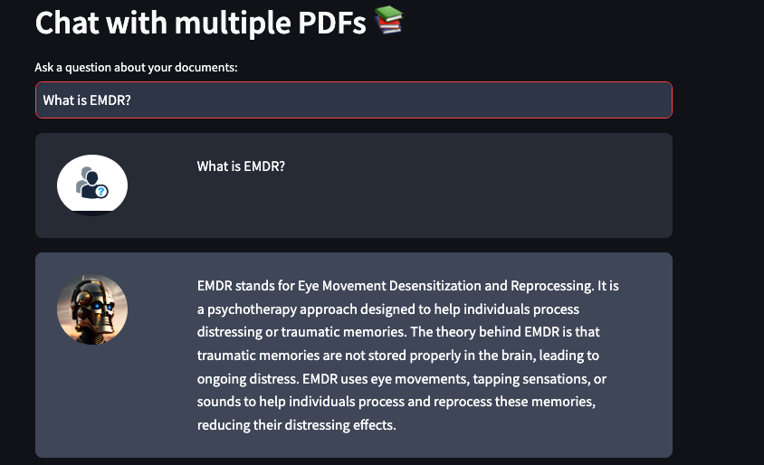
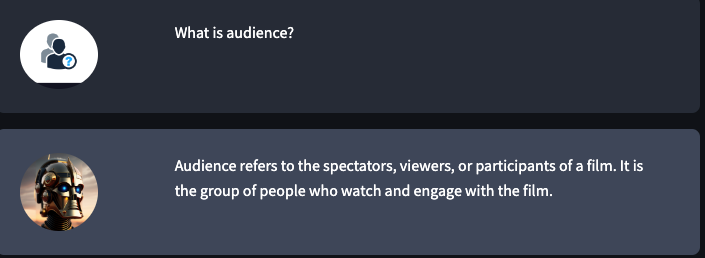
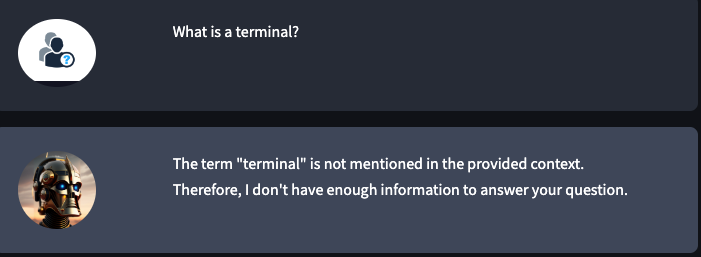

# Ask your PDFs about the information included in them.

## Overview
The ASK your PDFs app is written in Python and lets you talk to multiple PDF files.  This app uses a language model to give you correct replies to your questions about the PDFs. Please keep in mind that the app will only answer questions about the PDFs that are opened.

A live version of the application can be found on Streamlit Community Cloud https://askyourpdfs-64e8ky8z8tvtdkzjmyqb8e.streamlit.app/ 

1. You need an Open API Key to use this app. You can get one at https://platform.openai.com/api-keys.

****

2. After that, you may upload the PDFs.

****

3. Ask your PDFs about the information included in them.

****
****

4. Answers to your questions will be provided as soon as they are related to the previously uploaded articles.

****

## Instalation

To run the ASK your PDFs locally, you will need to have Python 3.10 or higher installed. Then, you can clone the repository to your local machine and install the required packages by running:

1. `git clone https://github.com/KarolinaRS/Ask_your_pdfs.git`

2. `pip install -r requirements.txt`

Run the app.py file using the Streamlit CLI. Execute the following command:

`streamlit run app.py`

The application will launch your default web browser and display the user interface.

